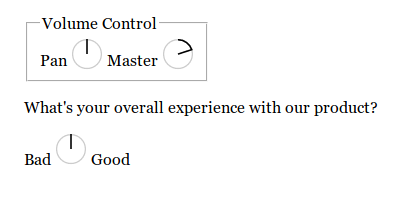

# daw-ui

A knob you can control by dragging, simpler than any in Ableton Live 9.

Replace `<input type="number">`.



## Project setup
```
yarn install
```

### Compiles and hot-reloads for development
```
yarn run serve
```

### Compiles and minifies for production
```
yarn run build
```

### Run your tests
```
yarn run test
```

### Lints and fixes files
```
yarn run lint
```
